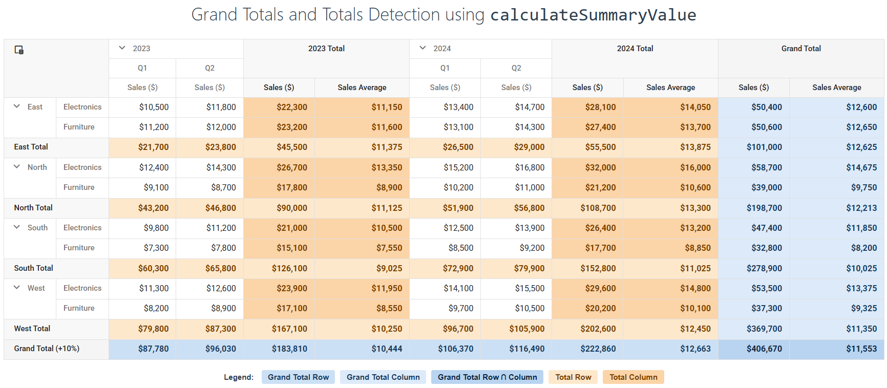

<!-- default badges list -->

[](https://supportcenter.devexpress.com/ticket/details/T1327685)
[](https://docs.devexpress.com/GeneralInformation/403183)
[](#does-this-example-address-your-development-requirementsobjectives)
<!-- default badges end -->
# DevExtreme PivotGrid - Detect Grand Total and Total Rows and Columns using calculateSummaryValue

This example uses the [calculateSummaryValue](https://js.devexpress.com/Documentation/ApiReference/Data_Layer/PivotGridDataSource/Configuration/fields/#calculateSummaryValue) function to detect Grand Total and Total rows and columns in the DevExtreme [PivotGrid](https://js.devexpress.com/Documentation/Guide/UI_Components/PivotGrid/Overview/) and apply custom aggregation logic to each cell type.



## Implementation Details 

The [calculateSummaryValue](https://js.devexpress.com/Documentation/ApiReference/Data_Layer/PivotGridDataSource/Configuration/fields/#calculateSummaryValue) function receives a [Summary Cell](https://js.devexpress.com/Documentation/ApiReference/UI_Widgets/dxPivotGrid/Summary_Cell/) object that exposes traversal methods (for example, `parent()`, `children()`, `prev()`) for navigating the pivot cell hierarchy. Use these methods to determine the cell type.

The following code detects Grand Total and Total columns:

```JavaScript
calculateSummaryValue(cell) {
    const columnParent = cell.parent('column');

    const isGrandTotalColumn = !columnParent;
    const isTotalColumn = columnParent && !columnParent.parent('column');
    
    if (isGrandTotalColumn) {
        // custom logic
    }

    if (isTotalColumn) {
        // custom logic
    }
    // ...
}
```

The following code detects Grand Total and Total rows:

```JavaScript
calculateSummaryValue(cell) {
    const rowParent = cell.parent("row");

    const isGrandTotalRow = !rowParent;
    const isTotalRow = rowParent && !rowParent.parent("row");
    
    if (isGrandTotalRow) {
        // custom logic
    }

    if (isTotalRow) {
        // custom logic
    }
    // ...
}
```

Detection is based on hierarchy depth. Each call to `parent()` moves one level up in the row or column hierarchy. A Grand Total cell has no parent (depth 0), while a Total cell has a parent but that parent has no parent of its own (depth 1). Regular cells are at depth 2 or deeper.

## Files to Review

- **Angular**
    - [app.component.ts](Angular/src/app/app.component.ts)
- **React**
    - [App.tsx](React/src/App.tsx)
- **Vue**
    - [HomeContent.vue](Vue/src/components/HomeContent.vue)
- **jQuery**
    - [index.js](jQuery/src/index.js)
- **ASP.NET Core**    
    - [Index.cshtml](ASP.NET%20Core/Views/Home/Index.cshtml)

## Documentation
- [Getting Started with PivotGrid](https://js.devexpress.com/Documentation/Guide/UI_Components/PivotGrid/Getting_Started_with_PivotGrid/)
- [PivotGrid API - calculateSummaryValue](https://js.devexpress.com/Documentation/ApiReference/Data_Layer/PivotGridDataSource/Configuration/fields/#calculateSummaryValue)
- [PivotGrid API - Summary Cell](https://js.devexpress.com/jQuery/Documentation/ApiReference/UI_Components/dxPivotGrid/Summary_Cell/)

<!-- feedback -->
## Does This Example Address Your Development Requirements/Objectives?

[](https://www.devexpress.com/support/examples/survey.xml?utm_source=github&utm_campaign=devextreme-pivotgrid-grand-total-and-total-detection&~~~was_helpful=yes) [](https://www.devexpress.com/support/examples/survey.xml?utm_source=github&utm_campaign=devextreme-pivotgrid-grand-total-and-total-detection&~~~was_helpful=no)

(you will be redirected to DevExpress.com to submit your response)
<!-- feedback end -->
